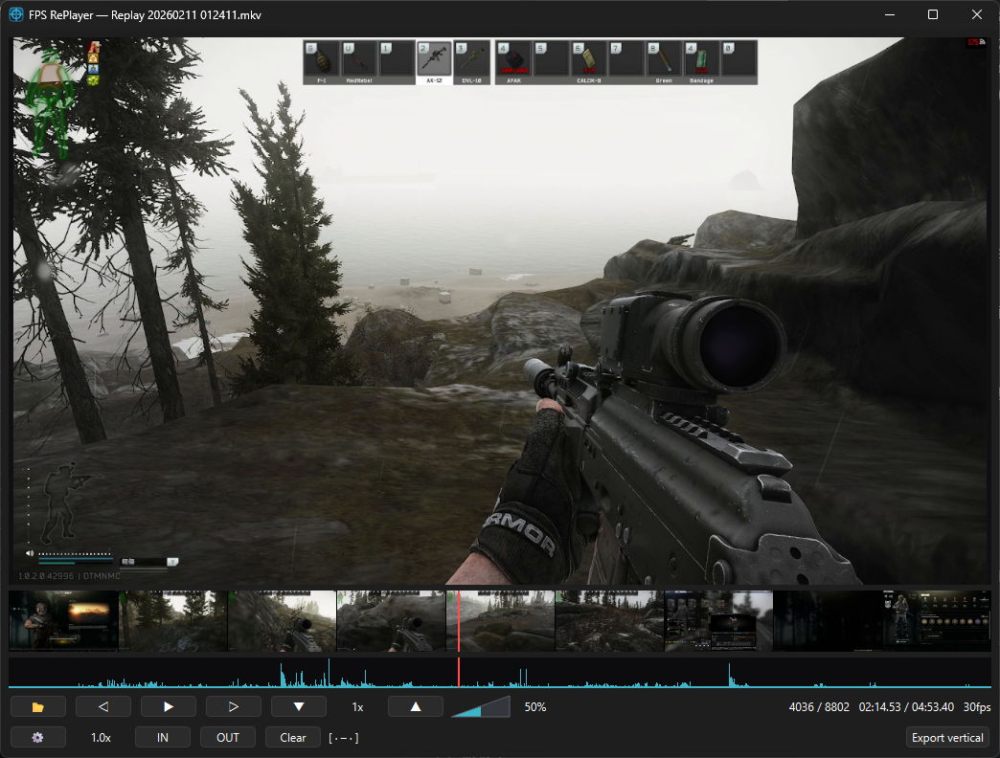
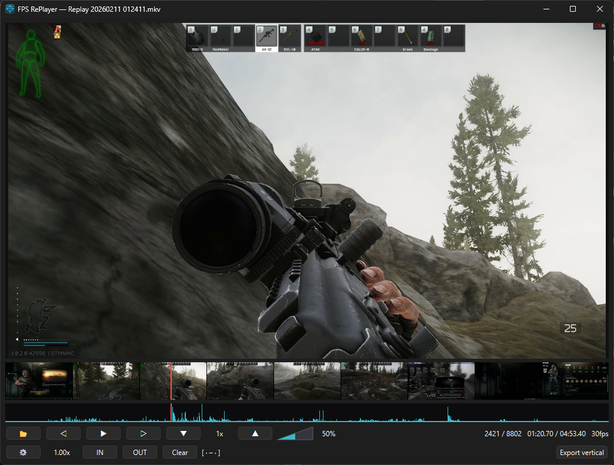
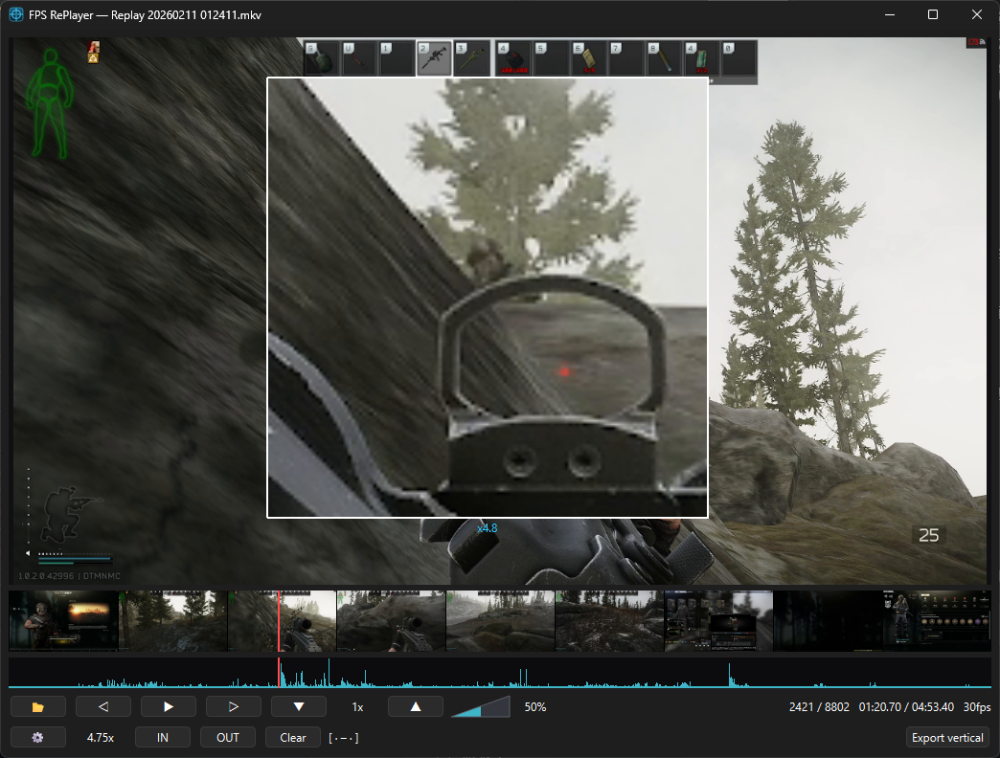
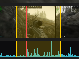

# FPS RePlayer  (v1.3.1)

[English](README.md) | 日本語

**公式サイト:** https://capycappy.com/fps-replayer/

タルコフ等の録画を「コマ単位で前後に行き来 ＋ カーソル追従の虫めがねで部分拡大」して
検証するための Windows デスクトップ動画プレイヤー。気になった部分を **縦型動画**として
切り出す機能つき。

## スクリーンショット



*メイン画面 — 動画＋サムネイル帯＋音声波形タイムライン（銃声など大きい音はスパイクで分かる）。*

**カーソル追従の虫めがね**（Ctrl + マウスホイール）:

| 通常 | 拡大時 |
|------|--------|
|  |  |



*サムネイル帯＋波形タイムライン。クリックでシーク、Ctrl/AltクリックでIN/OUT範囲（黄色）、赤線が再生位置。*

## ダウンロード（そのまま使う）

1. [**Releases**](../../releases) ページから `FPSRePlayer-vX.Y.Z-win64.zip` をダウンロード
2. フォルダごと解凍
3. **`FPSRePlayer.exe`** をダブルクリック（Python・インストール不要）

> 初回起動時に SmartScreen の警告（「Windows によって PC が保護されました」）が出ることがあります。
> **「詳細情報」→「実行」** で起動できます（未署名のため）。

## 機能と操作

| 機能 | 操作 |
|------|------|
| 再生 / 一時停止 | `Space` / ボタン / **プレイヤーを左クリック**（ドラッグ時は無反応）|
| コマ戻し（1フレーム後退）| `←`、または **Shift+ホイール下**。ボタンは長押しで連続送り |
| コマ送り（1フレーム前進）| `→`、または **Shift+ホイール上**。ボタンは長押しで連続送り |
| 倍速・低速 | `↑` 速く / `↓` 遅く、**マウスホイール**でも変更（0.1〜16倍）|
| 等倍に戻す | **マウスホイールをクリック**（中ボタン）|
| 虫めがね（カーソル追従拡大）| **Ctrl + マウスホイール**で拡大/縮小。等倍では枠は非表示、拡大すると白枠が出る（最大20倍）|
| シーク | 下部タイムライン（サムネイル帯／波形）をクリック。再生中も停止しない |
| IN / OUT の設定 | `I` / `O`、またはタイムラインの Ctrl / Alt クリック |
| 前 / 次のファイル | `Ctrl + ←` / `Ctrl + →`（同じフォルダ内を名前順に移動）|
| ファイルを開く / 履歴 | `Ctrl + O`、ドラッグ&ドロップ、**プレイヤー上で右クリック**すると直近10件 |
| 音量 | 再生コントロールの音量スライダー（ファイルを開く前から操作可）|

- 虫めがねは常時カーソル追従（チェックボックス不要）。等倍では何も出ない。
- 現在フレーム番号・時間・fps・速度・拡大率は画面に常時表示。
- 音声は倍速・低速にも追従して再生（音程は速度に応じて変化）。
- キーボード・マウスの割り当ては ⚙ 設定ダイアログで自由に変更可能。

### タイムライン（シークバー兼用）

下部に**サムネイル帯（フィルムストリップ）**と**音声波形**を表示。どちらもシークバーを兼ねる。

- クリック / ドラッグ：その位置へシーク
- **Ctrl + クリック：In点を設定**
- **Alt + クリック：Out点を設定**
- 銃声など大きい音は波形のスパイクで一目で分かる。

### IN / OUT とクリップ（複数区間）

`I` / `O`（現在位置）またはタイムラインの Ctrl/Alt クリックで IN/OUT を設定。
**「＋」を押すと現在の IN–OUT がクリップとして確定**され、次の区間を選べる。
クリップはタイムラインに**番号付きの黄色い帯**で表示される。

- **⏮ / ⏭**：前後のクリップの IN へジャンプして再生
- **▶#**：プレビュー — クリップの範囲だけを番号順に連続再生（書き出し結果の事前確認）
- **黄色のIN/OUT線は選択不要で直接ドラッグ**して調整可能。IN–OUT範囲の中央に出る
  **「＋」クリックでクリップ追加**、範囲やクリップ帯の**右クリックで削除**
- クリップ選択中は `I` / `O`（Ctrl/Altクリックも）で**そのクリップの位置を修正**。
  「＋」で選択解除して新規クリップ作成へ戻る
- **全クリアは取り消し可能**（ボタンが「取り消す」に変わり、新たにIN/OUTを打つまで有効）
- IN/OUT とクリップは**動画ごとに自動保存**（1本あたり約100バイト、保存先は
  `%APPDATA%\FPSRePlayer\clips.json`）され、同じ動画を開き直すと復元される

### 書き出し（縦型 9:16 / 横型 16:9）

1. 「動画書き出し」を押し、**縦型 9:16** か **横型 16:9** を選ぶ → 画面に切り出し枠が出る
2. 枠の中をドラッグで**移動**、四隅をドラッグで**拡大縮小**（縦横比は維持）
3. 「この範囲で書き出し」→ **クリップごとの速度**・解像度・音声・**フェードのトランジション**を
   選んで保存

複数のクリップは**時系列順に連結**され、歪みのない1本の動画（H.264 + AAC）として
出力される（枠が収まらない場合のみ黒帯）。クリップが2個以上のときは境界に 0.3 秒の**フェード**を
入れられる。ダイアログに出力の長さと推定サイズ、書き出し中はリアルタイムの着地予測を
表示し、完了すると出力ファイルを選択した状態でエクスプローラーが開く。

**クリップごとの速度：** 書き出しダイアログでクリップ1つずつに速度（0.25〜4倍）を
指定できる。キルの瞬間はスロー、移動は倍速、といった組み合わせが1本の動画にできる。
音声は音程を保ったまま伸縮し、スローはコマを複製する。選んだ速度はタイムラインの
クリップ帯に `2 0.5x` のように表示され、クリップと一緒に保存される。**▶# プレビュー**も
各クリップをその速度で再生する。

## 言語・アップデート通知

英語 / 日本語対応（起動時にOS言語を自動判定、⚙設定で切替）。
起動時にGitHubの最新Releaseを確認し、新しい版があればタイトルバー横に🔔ボタンを表示
（クリックでダウンロードページを開く）。GitHub公開APIへのGETリクエスト1回のみで
個人情報は送信しない。⚙設定でOFFにできる。

## 対応フォーマット

PyAV（内蔵 FFmpeg）採用。MP4 / MKV / MOV / AVI / WebM / FLV / TS / WMV など、
H.264・H.265(HEVC)・AV1・VP9 等の主要コーデックに対応。別途 FFmpeg のインストールは不要。

## ソースから実行

- Python 3.12
- 依存ライブラリ: `python -m pip install -r requirements.txt`
- 起動: `run_player.bat` をダブルクリック、または `python src\app.py`

## 配布用 exe の作成

`build_exe.bat` をダブルクリック、または:

```
python -m pip install pyinstaller
python -m PyInstaller --noconfirm --windowed --name "FPSRePlayer" --collect-all av src\app.py
```

`build_exe.bat` の出力先はリポジトリ外の `%USERPROFILE%\app\FPSRePlayer\`（直下に `FPSRePlayer.exe`）。
フォルダごと配布（zip にして GitHub の Releases に添付）。
`--collect-all av` で FFmpeg が同梱されるため配布先に FFmpeg は不要。

配布前に出力フォルダ内を `Users\` で検索し（例: `findstr /s /m "Users\\" FPSRePlayer\*`）、
1件もヒットしないことを確認する（ビルド機のパスが残るとユーザー名が漏れる）。

## ライセンス

MIT — [LICENSE](LICENSE) を参照。
